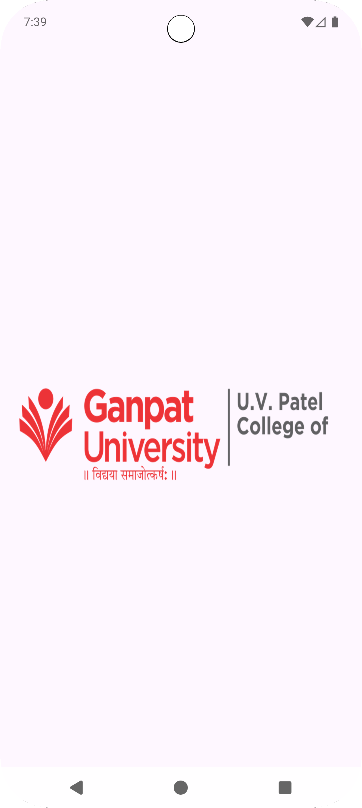
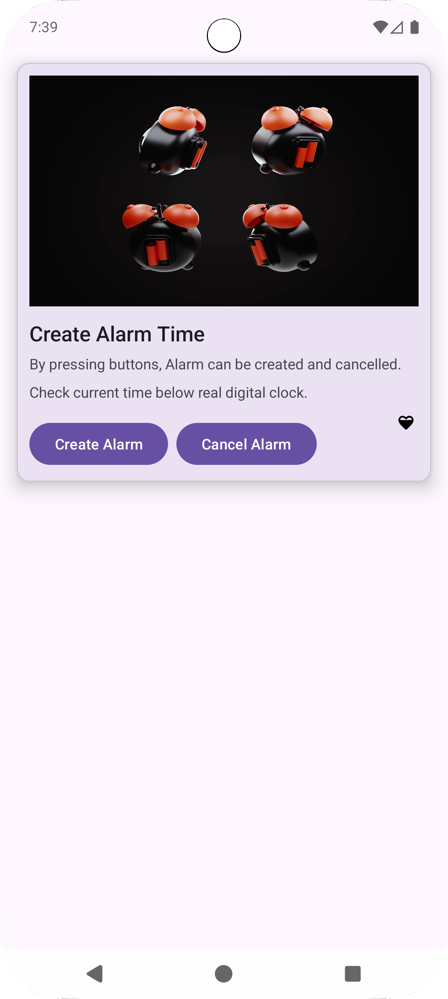

# Android Animation Demo App

A simple Android application demonstrating various animation techniques including frame animations, view animations, and splash screen functionality.

## 📱 About the App

This Android application showcases different types of animations commonly used in mobile app development:

- **Splash Screen**: Features an animated logo with frame animation and view animation
- **Main Activity**: Displays animated alarm clock and heart icons with frame animations
- **Material Design**: Uses Material CardView for a modern UI design

## 🎯 Features

- **Splash Screen Animation**
  - Animated logo with frame-by-frame animation
  - Combined with view animation (grow and spin effect)
  - Automatic transition to main activity after animation completes

- **Main Activity Animations**
  - Animated alarm clock icon with frame animation
  - Pulsating heart icon animation
  - Material Design card layout
  - Interactive buttons for alarm creation and cancellation

## 🚀 How to Run

### Prerequisites
- Android Studio (latest version recommended)
- Android SDK (API level 21 or higher)
- Android device or emulator

### Installation Steps

1. **Clone or Download the Project**
   ```bash
   git clone <repository-url>
   cd "Practical 6"
   ```

2. **Open in Android Studio**
   - Launch Android Studio
   - Select "Open an existing project"
   - Navigate to the project folder and select it

3. **Sync Project**
   - Android Studio will automatically sync the project
   - Wait for the Gradle sync to complete

4. **Run the App**
   - Connect an Android device via USB debugging or start an emulator
   - Click the "Run" button (green play icon) or press `Shift + F10`
   - Select your target device and click "OK"

## 📱 How It Works

### App Flow

1. **Splash Screen (SplashActivity)**
   - App launches with an animated logo
   - Frame animation plays automatically when the window gains focus
   - View animation (grow and spin) runs simultaneously
   - After animation completes, automatically navigates to MainActivity

2. **Main Activity (MainActivity)**
   - Displays a Material Design card with alarm-related content
   - Alarm clock icon plays frame animation continuously
   - Heart icon shows a pulsing animation effect
   - Two buttons for "Create Alarm" and "Cancel Alarm" (UI only)

### Animation Types Used

- **Frame Animation**: Sequential display of drawable resources
- **View Animation**: Transform animations (translate, scale, rotate)
- **AnimationDrawable**: For controlling frame animations programmatically

## 🛠️ Technical Details

### Project Structure
```
app/
├── src/main/
│   ├── java/com/bytemap/mad_23012011026_practical4/
│   │   ├── SplashActivity.kt
│   │   └── MainActivity.kt
│   ├── res/
│   │   ├── drawable/          # Animation drawable resources
│   │   ├── anim/              # View animation files
│   │   ├── layout/            # Activity layouts
│   │   └── values/            # String resources
│   └── AndroidManifest.xml
```

### Key Components

- **SplashActivity**: Handles splash screen with combined animations
- **MainActivity**: Main interface with animated elements
- **Animation Resources**: XML files defining frame and view animations
- **Material Design**: Modern UI components and styling

## 📸 Screenshots

<!-- Add your screenshots here -->
<div align="center">
  
  
</div>
## 🔧 Customization

### Adding New Animations
1. Create drawable resources in `res/drawable/`
2. Define animation lists in XML files
3. Reference animations in your Kotlin code using `AnimationDrawable`

### Modifying Existing Animations
- Edit XML files in `res/drawable/` for frame animations
- Modify `res/anim/` files for view animations
- Adjust timing and properties as needed

## 📝 Notes

- This is a demonstration project for learning Android animations
- The alarm functionality is UI-only (no actual alarm implementation)
- Animations are optimized for smooth performance
- Compatible with Android API level 21 and above

## 🤝 Contributing

Feel free to fork this project and submit pull requests for improvements or additional features.

## 📄 License

This project is for educational purposes. Use it as a learning resource for Android animation development.

---

**Student ID**: 23012011026  
**Practical**: 6  
**Course**: Mobile Application Development
